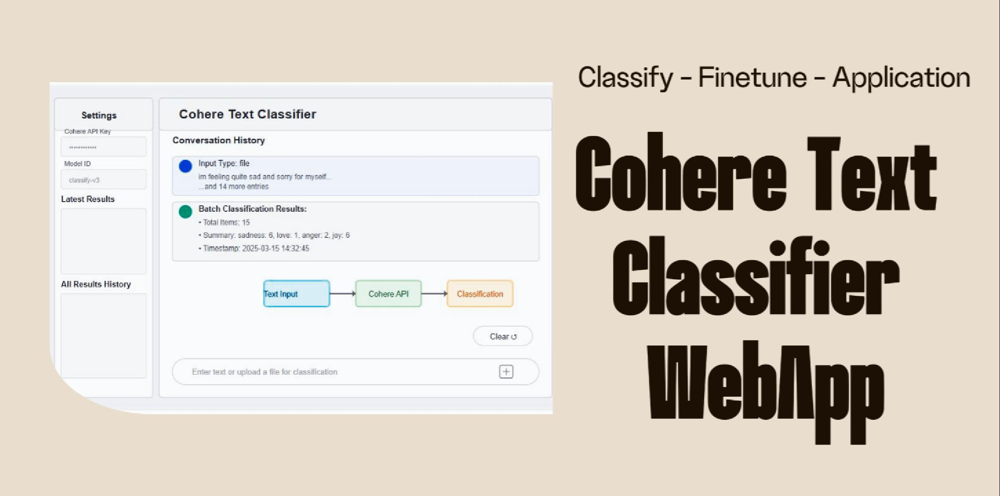

Streamlit App: https://classifier-cohere.streamlit.app/

Kaggle Dataset: https://www.kaggle.com/datasets/praveengovi/emotions-dataset-for-nlp

[]([https://www.youtube.com/watch?v=VIDEO_ID](https://studio.youtube.com/video/MIwWKXrRFWI))


## Cohere Text Classifier Application
This is a Streamlit application that uses Cohere's AI classification model to analyze and categorize text. The app can process individual text inputs or batch process multiple texts from files.

## How to Use the Application
### Setup:
Enter your Cohere API Key in the sidebar
Optionally specify the Model ID if you want to use a different model than the default

### Input Methods:
Single text: Type a statement or question in the chat input
Multiple texts: Type multiple statements separated by semicolons
File upload: Upload a text file (.txt), CSV, or Excel file containing text to classify

### Processing Options:
Text files: Content will be split by semicolons (;)
CSV files: The first column will be used as input text
For all files: Up to 50 entries can be processed at once

### Results:
In chat: See a summary of classification results
Latest Results: View detailed results of your most recent classification in the sidebar
All Results History: Browse all classification results since your last reset in the sidebar
All results include timestamps showing when each classification was performed

### Reset:
Click "Clear ↺" to reset the chat history and all accumulated results

## How to build this
To replicate and use this Cohere Text Classifier application from GitHub, follow these steps:
(Optional) Train your own model - https://docs.cohere.com/v2/docs/classify-starting-the-training

Clone the repository
```bash
git clone https://github.com/AkanimohOD19A/cohere-text-classifier.git
cd cohere-text-classifier
```
Set up a virtual environment
```bash
python -m venv venv
source venv/bin/activate  # On Windows: venv\Scripts\activate

# Install dependencies
pip install -r requirements.txt
```
Create/Update a secrets file
Create a file named .streamlit/secrets.toml with:
```bash
mkdir .streamlit
cd .streamlit
touch .streamlit/secrets.toml
```
pass in your secrets:
MODEL_ID = "your-default-model-id-here"

Run the application
```bash
streamlit run app.py
```

That's it.
